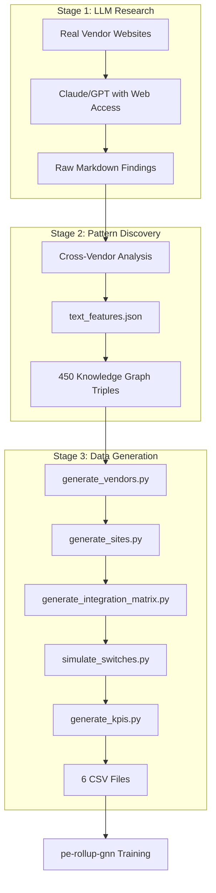

# Architecture

## System Overview

The Causal Synth Engine is a three-stage pipeline that transforms LLM web research into causally-grounded synthetic training data.



## Stage 1: LLM-as-Researcher

**Objective:** Extract structured vendor information from the web

**Process:**
1. Created 5 batch prompts covering 20 dental vendors
2. Used Claude Opus, Sonnet, and ChatGPT Pro with live internet access
3. Extracted EHR integrations, API types, user feedback, KPI claims

**Models Used:**
| Batch | Category | Model |
|-------|----------|-------|
| 1 | Lab (V001-V004) | Claude Opus 4.1 |
| 2 | RCM (V005-V007) | Claude Sonnet 4.5 |
| 3 | Telephony (V008-V010) | ChatGPT Pro |
| 4 | Scheduling/Clearinghouse (V011-V015) | Claude Opus 4.1 |
| 5 | IT/Supplies (V016-V020) | Claude Sonnet 4.5 |

**Output:** Raw markdown files in `research/prompts/`

## Stage 2: LLM-as-Analyst

**Objective:** Discover cross-vendor patterns and category-level rules

**Key Discoveries:**

| Category | Pattern | Quality Code | Evidence |
|----------|---------|--------------|----------|
| Lab | ALL partial_csv | 1 | Portal uploads, STL files |
| Telephony | ALL full_api | 2 | Call Pop requires real-time |
| Scheduling | ALL full_api | 2 | Self-booking requires real-time |
| Supplies | ALL partial_csv | 1 | Separate portals even for owned EHRs |
| RCM | Tier-dependent | 1-2 | Premium vendors have full API |
| Clearinghouse | Mixed | 0-2 | Vendor + EHR dynamics |

**This is the critical insight:** 5 of 7 categories have **fixed integration patterns**, not probabilistic ones.

**Output:** `text_features.json` with ~450 knowledge graph triples

## Stage 3: Python Generators

**Objective:** Generate synthetic instances that obey discovered causal rules

### Generator Pipeline

```
generate_vendors.py    → vendors.csv (20 real vendors)
        ↓
generate_sites.py      → sites.csv (100 synthetic practices)
        ↓
generate_integration_matrix.py → integration_matrix.csv
        ↓                        (applies category-level rules)
generate_initial_state.py → initial_state.csv
        ↓
simulate_switches.py   → contracts_2019_2024.csv (866 contracts)
        ↓
generate_kpis.py       → kpis.csv
```

### Integration Matrix Generation

The key causal mechanism is encoded here:

```python
def assign_integration_quality(vendor, ehr, category):
    """
    Applies discovered category-level rules, NOT random assignment
    """
    if category == 'Lab':
        return 1  # ALL partial_csv (from web research)
    elif category == 'Telephony':
        return 2  # ALL full_api (from web research)
    elif category == 'Scheduling':
        return 2  # ALL full_api (from web research)
    elif category == 'RCM':
        return vendor.tier  # Tier-dependent
    # ...
```

### Vendor Switching Simulation

Switching probability depends on integration quality:

```python
def compute_switch_probability(current_integration_quality, potential_vendor):
    """
    High integration quality → low switching probability
    Low integration quality → high switching probability
    """
    friction = 2 - current_integration_quality  # 0, 1, or 2
    base_prob = friction * 0.15  # 0%, 15%, or 30%
    # Apply modifiers for vendor tier, peer adoption, etc.
    return adjusted_prob
```

## Output Files

| File | Rows | Description |
|------|------|-------------|
| `vendors.csv` | 20 | Real vendor entities with categories, tiers |
| `sites.csv` | 100 | Synthetic dental practices with regions, EHRs |
| `integration_matrix.csv` | 400 | 20×20 vendor-EHR integration quality matrix |
| `initial_state.csv` | 700 | Initial site-vendor contracts (7 per site) |
| `contracts_2019_2024.csv` | 866 | Full contract history with switches |
| `kpis.csv` | 500 | Site-level KPI time series |

## Causal Validation

The downstream R-GCN model achieved:
- **PR-AUC: 0.9407** (beats LightGBM baseline)
- **Ablation:** Removing `integration_quality` → **-25.5% PR-AUC**

This proves the model learned the causal mechanism we encoded, not spurious correlations.

## Directory Structure

```
causal-synth-engine/
├── src/
│   ├── __init__.py
│   ├── generate_all_data.py          # Master orchestration
│   ├── generate_sites.py             # Site generation
│   ├── generate_vendors.py           # Vendor encoding
│   ├── generate_integration_matrix.py # Causal rules
│   ├── generate_initial_state.py     # Initial contracts
│   ├── simulate_switches.py          # Switching simulation
│   └── generate_kpis.py              # KPI generation
├── research/
│   ├── prompts/                       # LLM research prompts
│   └── results/                       # Knowledge graph output
├── outputs/                           # Generated CSVs
│   └── example/                       # Sample outputs
└── docs/
    └── METHODOLOGY.md                 # Detailed methodology
```
