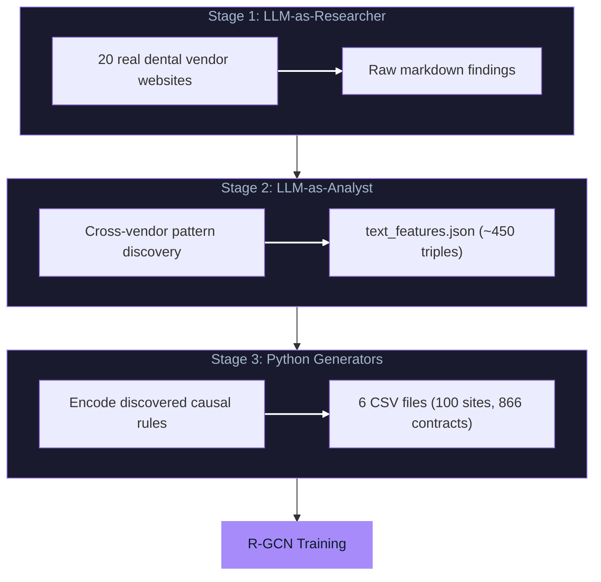
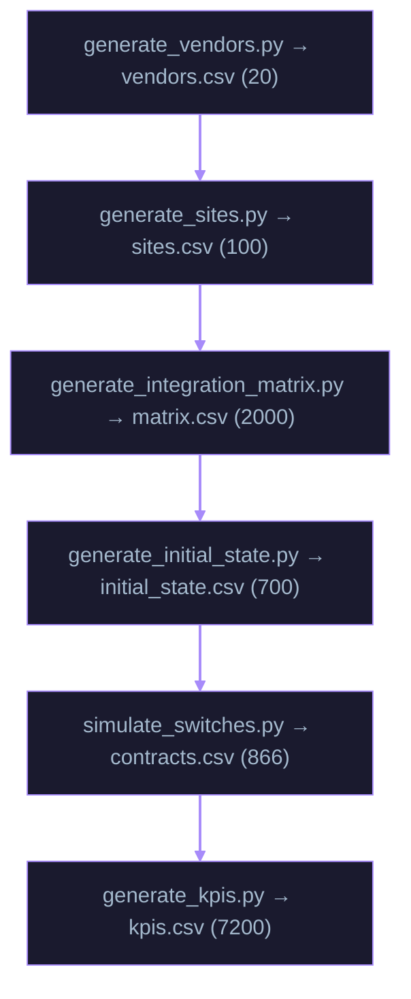

# Architecture

## System Overview

The Causal Synth Engine is a three-stage pipeline that transforms LLM web research into causally-grounded synthetic training data.



---

## Stage 1: LLM-as-Researcher

**Objective:** Extract structured vendor information from the web

**Process:**
1. Created 5 batch prompts covering 20 dental vendors across 7 categories
2. Used Claude Opus, Sonnet, and ChatGPT Pro with live internet access
3. Extracted: EHR integrations, API types, DSO partnerships, KPI claims, pricing

**Batch Allocation:**

| Batch | Category | Vendors | Model | Why This Model |
|-------|----------|---------|-------|----------------|
| 1 | Lab | V001-V004 | Claude Opus 4.1 | Complex integration research |
| 2 | RCM | V005-V007 | Claude Sonnet 4.5 | Good balance of speed/quality |
| 3 | Telephony | V008-V010 | ChatGPT Pro | Better real-time web access |
| 4 | Scheduling/Clearinghouse | V011-V015 | Claude Opus 4.1 | Complex multi-vendor batch |
| 5 | IT/Supplies | V016-V020 | Claude Sonnet 4.5 | Speed for simpler vendors |

**Output:** Raw markdown research files

---

## Stage 2: LLM-as-Analyst

**Objective:** Discover cross-vendor patterns and category-level rules

**Critical Discovery:** 5 of 7 categories have **FIXED** integration patterns (not probabilistic):

| Category | Pattern | Quality | Evidence |
|----------|---------|---------|----------|
| Lab | ALL partial_csv | 1 | Portal uploads, STL files |
| Telephony | ALL full_api | 2 | Call Pop requires real-time sync |
| Scheduling | ALL full_api | 2 | Calendar write-back requires real-time |
| Supplies | ALL partial_csv | 1 | Separate e-commerce portals |
| RCM | Tier-dependent | 1-2 | Premium vendors invest in integrations |
| Clearinghouse | Mixed | 0-2 | Depends on vendor + EHR combination |
| IT_MSP | Ownership-based | 1-2 | Henry Schein owns Dentrix → full_api |

**Output:** `text_features.json` with ~450 knowledge graph triples

---

## Stage 3: Python Generators

**Objective:** Generate synthetic instances that obey discovered causal rules

### Generator Pipeline



### Core Causal Mechanism

**Integration Quality Assignment:**
```python
def assign_integration_quality(vendor, site_ehr, category):
    """
    Applies DISCOVERED rules, not random assignment
    """
    if category == 'Lab':
        return 1  # ALL partial_csv (industry standard)
    elif category == 'Telephony':
        return 2  # ALL full_api (real-time required)
    elif category == 'Scheduling':
        return 2  # ALL full_api (calendar sync required)
    elif category == 'Supplies':
        return 1  # ALL partial_csv (separate portals)
    elif category == 'RCM':
        # Tier-dependent: premium vendors have better integrations
        return 2 if vendor.tier == 1 and site_ehr in vendor.certified_ehrs else 1
    # ... additional rules
```

**Vendor Switching Simulation:**
```python
P_switch = base_monthly × integration_multiplier × fatigue_multiplier

# Integration quality drives switching
integration_multiplier = {
    0: 2.0,   # Manual entry → high friction → more likely to switch
    1: 1.3,   # CSV workflow → moderate friction
    2: 0.7    # Full API → sticky, less likely to switch
}[current_integration_quality]

# Recent switches reduce future switching
fatigue_multiplier = {
    '<12 months': 0.3,   # Exhausted from recent change
    '12-24 months': 0.7, # Hesitant
    '>24 months': 1.0    # Ready for change
}[time_since_last_switch]
```

---

## Output Files

| File | Rows | Description |
|------|------|-------------|
| `vendors.csv` | 20 | Real vendor entities (National Dentex, Weave, etc.) |
| `sites.csv` | 100 | Synthetic practices with regions, EHRs, revenue |
| `integration_matrix.csv` | 2,000 | 100 sites × 20 vendors with quality scores |
| `initial_state_2019.csv` | 700 | Starting contracts (7 vendors per site) |
| `contracts_2019_2024.csv` | 866 | Full history including 166 switches |
| `kpis.csv` | 7,200 | Monthly Days A/R and Denial Rate (72 months × 100 sites) |

---

## Data Validation

**Industry Benchmark Comparison:**

| Metric | Synthetic | Industry | Status |
|--------|-----------|----------|--------|
| Days A/R | 27.3 days | 30-40 days | PASS |
| Denial Rate | 5.6% | 7-9% | PASS |
| Switch Rate | 4.0% annual | ~5% | PASS |

---

## Downstream Validation

The R-GCN model trained on this data achieved:
- **PR-AUC: 0.9407** (beats LightGBM baseline by +0.37%)
- **Ablation:** Removing `integration_quality` → **-25.5% PR-AUC**

This proves the model learned the causal mechanism we encoded.

---

## Directory Structure

```
causal-synth-engine/
├── src/
│   ├── generate_all_data.py          # Master orchestration
│   ├── generate_sites.py             # Site generation
│   ├── generate_vendors.py           # Vendor encoding
│   ├── generate_integration_matrix.py # Causal rules
│   ├── generate_initial_state.py     # Initial contracts
│   ├── simulate_switches.py          # Switching simulation
│   └── generate_kpis.py              # KPI generation
├── research/
│   ├── prompts/                       # LLM research prompts
│   └── results/                       # Research outputs
├── outputs/                           # Generated CSVs
└── docs/
    └── METHODOLOGY.md                 # Full methodology
```
