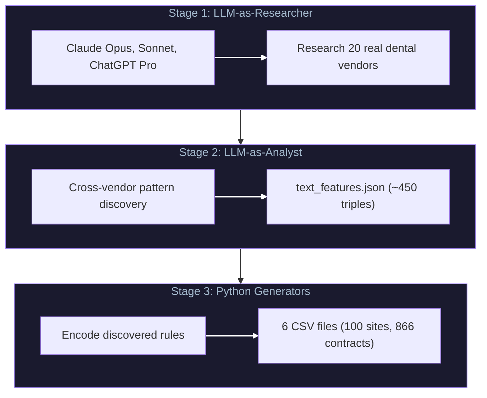

<div align="center">

**A deterministic market simulator where LLMs perform staged research + analysis, and the discovered mechanisms are compiled into generators that produce trainable datasets (sites, contracts, KPIs) for downstream models.**

**(for [PE Rollup Intelligence Platform](https://github.com/ges257/pe-rollup-intelligence-system))**


[Architecture](ARCHITECTURE.md) · [Challenges](CHALLENGES.md) · [Learnings](LEARNINGS.md)

</div>

---

<div align="center">

In 2026, the constraint is rarely "model code" — it's getting **enough high-quality, compliant data** to train, evaluate, and harden systems for production. This project is an **AGENTIC DATA FACTORY**

This work maps directly to a variety of proprietary Agent methods I developed to push the LLMs — this includes but is not limited to — custom prompting, decomposition, long-horizon reliability via deterministic compilation, and curriculum design to improve downstream model performance.

</div>

## Outcome

Generated **100 synthetic dental practices** and **866 contracts** to eliminate cold-start data scarcity for the PE Rollup GNN project.

LLM-assisted research and cross-vendor analysis produced **auditable artifacts** (e.g., ~450 triples), which were then compiled into deterministic generation rules — ensuring the simulator encodes **verified mechanisms**, not assumptions.

## Technical Build

Built a deterministic market simulator by extracting mechanisms from industry research and vendor analysis, then encoding them directly into the generated graph structure.

Core idea: **integration quality influences acquisition value**, which drives **vendor switching behavior** — so the downstream GNN trains on ***MECHANISM-SHAPED DATA***, not random correlations.

---

## The Key Mechanism

```
Integration Quality → Acquisition Value → Vendor Switching
```

| Integration Quality | Friction | Switching Probability |
|---------------------|----------|----------------------|
| Full API (2) | Low | Low |
| Partial CSV (1) | Medium | Medium |
| None (0) | High | High |

---

## Three-Stage Pipeline



---

## Discovered Category Rules

These patterns were **discovered from web research**, not assumed:

| Category | Integration Pattern | Evidence |
|----------|---------------------|----------|
| Lab | ALL partial_csv | STL file uploads, portal workflows |
| Telephony | ALL full_api | Call Pop requires real-time sync |
| Scheduling | ALL full_api | Self-booking requires real-time sync |
| RCM | Tier-dependent | Premium vendors have better integrations |

---

## Validation

Data generated by this engine was used to train an R-GCN model:

| Metric | Value |
|--------|-------|
| **PR-AUC** | **0.9407** |
| Risk MAE | 1.14 days |
| ECE | 0.0000 (perfect calibration) |

**Critical ablation:** Removing `integration_quality` caused **-25.5% PR-AUC drop**, proving the model learned the causal mechanism.

---

## Project Structure

```
causal-synth-engine/
├── src/
│   ├── generate_all_data.py          # Master orchestration
│   ├── generate_sites.py             # 100 synthetic practices
│   ├── generate_vendors.py           # 20 real vendors
│   ├── generate_integration_matrix.py # Causal mechanism encoding
│   ├── generate_initial_state.py     # Initial contract states
│   ├── simulate_switches.py          # Vendor switching simulation
│   └── generate_kpis.py              # KPI generation
├── research/
│   ├── prompts/                       # LLM research prompts
│   └── results/                       # LLM research outputs
├── outputs/                           # Generated CSVs
└── docs/
    └── METHODOLOGY.md                 # Full pipeline documentation
```

---

## Usage

```bash
# Generate all synthetic data
python src/generate_all_data.py --output outputs/

# Generate specific components
python src/generate_sites.py
python src/generate_vendors.py
python src/generate_integration_matrix.py
python src/simulate_switches.py
python src/generate_kpis.py
```

---

## License

MIT

---

<div align="center">

**Part of the AI/ML Portfolio**

[Return to Home](https://github.com/ges257) | [LinkedIn](https://linkedin.com/in/gregory-e-schwartz)

</div>


